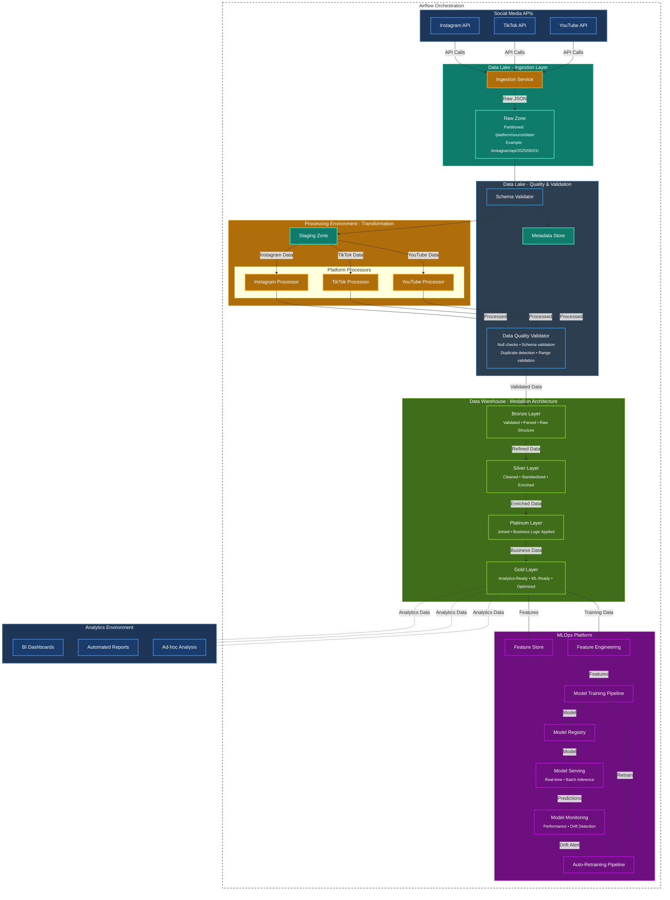

```mermaid
flowchart TD
    classDef api fill:#1a3c6c,stroke:#4a90e2,stroke-width:2px,color:white
    classDef storage fill:#0f7b6b,stroke:#50e3c2,stroke-width:2px,color:white
    classDef process fill:#b06e0b,stroke:#f5a623,stroke-width:2px,color:white
    classDef quality fill:#2c3e50,stroke:#3498db,stroke-width:2px,color:white
    classDef medallion fill:#3f6d1a,stroke:#7ed321,stroke-width:2px,color:white
    classDef mlops fill:#6d0f7f,stroke:#bd10e0,stroke-width:2px,color:white
    classDef analytics fill:#1a3c6c,stroke:#4a90e2,stroke-width:2px,color:white
    classDef default fill:#111,stroke:#333,stroke-width:1px,color:#eee,font-family:Helvetica

    %% ===== Airflow Orchestration =====
    subgraph Airflow["Airflow Orchestration"]
        direction TB
        
        %% ===== External APIs =====
        subgraph APIs["Social Media APIs"]
            direction LR
            InstagramAPI["Instagram API"]:::api
            TikTokAPI["TikTok API"]:::api
            YouTubeAPI["YouTube API"]:::api
        end
        
        %% ===== Data Lake - Ingestion =====
        subgraph Ingestion["Data Lake - Ingestion Layer"]
            direction TB
            IngestionService["Ingestion Service"]:::process
            RawZone["Raw Zone<br><sub>Partitioned: /platform/source/date/</sub><br><sub>Example: /instagram/api/2025/06/01/</sub>"]:::storage
        end
        
        %% ===== Data Lake - Validation =====
        subgraph Quality["Data Lake - Quality & Validation"]
            direction TB
            SchemaValidator["Schema Validator"]:::quality
            QualityValidator["Data Quality Validator<br><sub>Null checks • Schema validation<br>Duplicate detection • Range validation</sub>"]:::quality
            MetadataStore["Metadata Store"]:::storage
        end
        
        %% ===== Processing Environment - Transformation =====
        subgraph Transform["Processing Environment - Transformation"]
            direction TB
            StagingZone["Staging Zone"]:::storage
            subgraph Processors["Platform Processors"]
                direction LR
                IGProcessor["Instagram Processor"]:::process
                TTProcessor["TikTok Processor"]:::process
                YTProcessor["YouTube Processor"]:::process
            end
        end
        
        %% ===== Data Warehouse - Medallion Architecture =====
        subgraph Warehouse["Data Warehouse - Medallion Architecture"]
            direction TB
            Bronze["Bronze Layer<br><sub>Validated • Parsed • Raw Structure</sub>"]:::medallion
            Silver["Silver Layer<br><sub>Cleaned • Standardized • Enriched</sub>"]:::medallion
            Platinum["Platinum Layer<br><sub>Joined • Business Logic Applied</sub>"]:::medallion
            Gold["Gold Layer<br><sub>Analytics-Ready • ML-Ready • Optimized</sub>"]:::medallion
        end
        
        %% ===== MLOps Platform =====
        subgraph MLOps["MLOps Platform"]
            direction TB
            FeatureStore["Feature Store"]:::mlops
            FeatureExtraction["Feature Engineering"]:::mlops
            ModelTraining["Model Training Pipeline"]:::mlops
            ModelRegistry["Model Registry"]:::mlops
            ModelServing["Model Serving<br><sub>Real-time • Batch Inference</sub>"]:::mlops
            ModelMonitoring["Model Monitoring<br><sub>Performance • Drift Detection</sub>"]:::mlops
            RetrainingTrigger["Auto-Retraining Pipeline"]:::mlops
        end
    end
    
    %% ===== Analytics Environment =====
    subgraph Analytics["Analytics Environment"]
        direction TB
        Dashboards["BI Dashboards"]:::analytics
        Reports["Automated Reports"]:::analytics
        AdhocQuery["Ad-hoc Analysis"]:::analytics
    end
    
    %% ===== Data Flow =====
    InstagramAPI -->|API Calls| IngestionService
    TikTokAPI -->|API Calls| IngestionService
    YouTubeAPI -->|API Calls| IngestionService
    
    IngestionService -->|Raw JSON| RawZone
    RawZone --> SchemaValidator
    SchemaValidator --> MetadataStore
    SchemaValidator --> StagingZone
    
    StagingZone -->|Instagram Data| IGProcessor
    StagingZone -->|TikTok Data| TTProcessor
    StagingZone -->|YouTube Data| YTProcessor
    
    IGProcessor -->|Processed| QualityValidator
    TTProcessor -->|Processed| QualityValidator
    YTProcessor -->|Processed| QualityValidator
    
    QualityValidator -->|Validated Data| Bronze
    Bronze -->|Refined Data| Silver
    Silver -->|Enriched Data| Platinum
    Platinum -->|Business Data| Gold
    
    Gold -->|Training Data| FeatureExtraction
    Gold -->|Features| FeatureStore
    FeatureExtraction -->|Features| ModelTraining
    ModelTraining -->|Model| ModelRegistry
    ModelRegistry -->|Model| ModelServing
    ModelServing -->|Predictions| ModelMonitoring
    ModelMonitoring -.->|Drift Alert| RetrainingTrigger
    RetrainingTrigger -.->|Retrain| ModelTraining
    
    Gold -.->|Analytics Data| Dashboards
    Gold -.->|Analytics Data| Reports
    Gold -.->|Analytics Data| AdhocQuery

    %% ===== Environment Styling =====
    style APIs fill:#1d3557,stroke:#457b9d,stroke-width:2px,color:white
    style Ingestion fill:#0f7b6b,stroke:#50e3c2,color:white
    style Quality fill:#2c3e50,stroke:#3498db,color:white
    style Transform fill:#b06e0b,stroke:#f5a623,color:white
    style Warehouse fill:#3f6d1a,stroke:#7ed321,color:white
    style MLOps fill:#6d0f7f,stroke:#bd10e0,color:white
    style Analytics fill:#1d3557,stroke:#457b9d,stroke-width:2px,color:white
    style Airflow fill:none,stroke:#666,stroke-width:2px,stroke-dasharray:5 5
```
