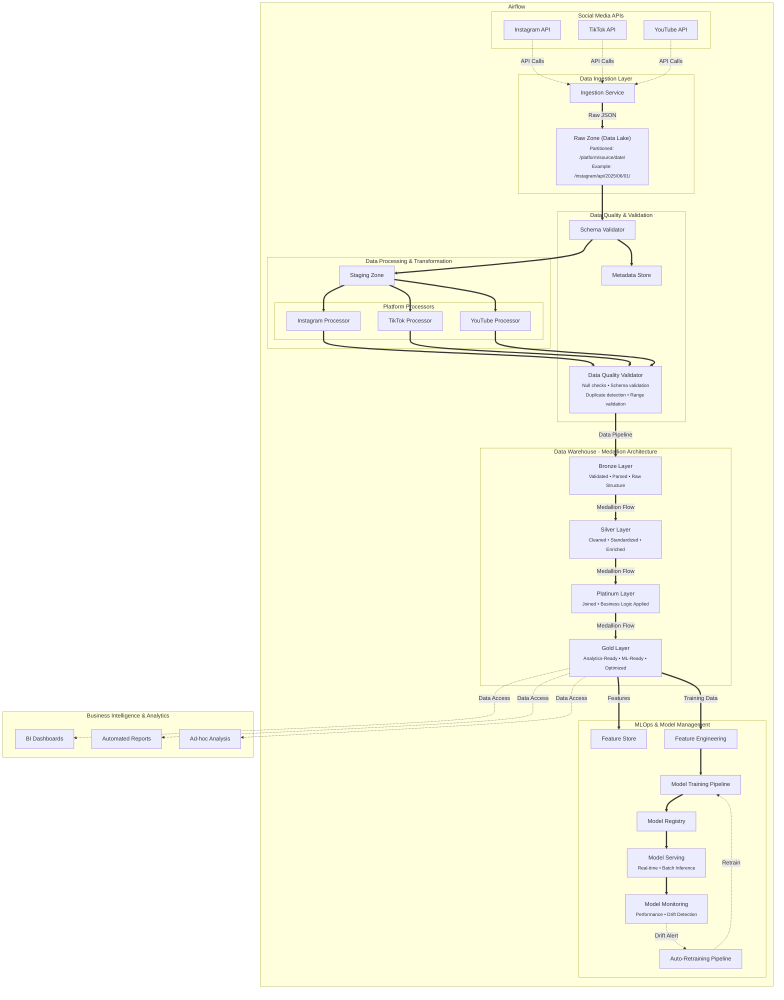

```mermaid
  flowchart TD
      %% Airflow orchestrates everything
      subgraph Airflow["Airflow"]
          direction TB
          
          %% Social Media APIs
          subgraph APIs["Social Media APIs"]
              direction LR
              InstagramAPI["Instagram API"]
              TikTokAPI["TikTok API"] 
              YouTubeAPI["YouTube API"]
          end
          
          %% Ingestion Layer
          subgraph Ingestion["Data Ingestion Layer"]
              direction TB
              IngestionService["Ingestion Service"]
              RawZone["Raw Zone (Data Lake)<br><sub>Partitioned: /platform/source/date/<br>Example: /instagram/api/2025/06/01/</sub>"]
          end
          
          %% Data Quality & Validation
          subgraph Quality["Data Quality & Validation"]
              direction TB
              SchemaValidator["Schema Validator"]
              QualityValidator["Data Quality Validator<br><sub>Null checks • Schema validation<br>Duplicate detection • Range validation</sub>"]
              MetadataStore["Metadata Store"]
          end
          
          %% Staging & Transformation
          subgraph Transform["Data Processing & Transformation"]
              direction TB
              StagingZone["Staging Zone"]
              subgraph Processors["Platform Processors"]
                  direction LR
                  IGProcessor["Instagram Processor"]
                  TTProcessor["TikTok Processor"]
                  YTProcessor["YouTube Processor"]
              end
          end
          
          %% Data Warehouse - Medallion Architecture
          subgraph Warehouse["Data Warehouse - Medallion Architecture"]
              direction TB
              Bronze["Bronze Layer<br><sub>Validated • Parsed • Raw Structure</sub>"]
              Silver["Silver Layer<br><sub>Cleaned • Standardized • Enriched</sub>"]
              Platinum["Platinum Layer<br><sub>Joined • Business Logic Applied</sub>"]
              Gold["Gold Layer<br><sub>Analytics-Ready • ML-Ready • Optimized</sub>"]
          end
          
          %% MLOps Pipeline
          subgraph MLOps["MLOps & Model Management"]
              direction TB
              FeatureStore["Feature Store"]
              FeatureExtraction["Feature Engineering"]
              ModelTraining["Model Training Pipeline"]
              ModelRegistry["Model Registry"]
              ModelServing["Model Serving<br><sub>Real-time • Batch Inference</sub>"]
              ModelMonitoring["Model Monitoring<br><sub>Performance • Drift Detection</sub>"]
              RetrainingTrigger["Auto-Retraining Pipeline"]
          end
      end
      
      %% Analytics (External - User Driven)
      subgraph Analytics["Business Intelligence & Analytics"]
          direction TB
          Dashboards["BI Dashboards"]
          Reports["Automated Reports"]
          AdhocQuery["Ad-hoc Analysis"]
      end
      %% Main data flow within Airflow - Clean, professional styling
      InstagramAPI -.->|"API Calls"| IngestionService
      TikTokAPI -.->|"API Calls"| IngestionService  
      YouTubeAPI -.->|"API Calls"| IngestionService
      
      IngestionService ==>|"Raw JSON"| RawZone
      RawZone ==> SchemaValidator
      SchemaValidator ==> MetadataStore
      SchemaValidator ==> StagingZone
      
      StagingZone ==> IGProcessor
      StagingZone ==> TTProcessor  
      StagingZone ==> YTProcessor
      
      IGProcessor ==> QualityValidator
      TTProcessor ==> QualityValidator
      YTProcessor ==> QualityValidator
      
      QualityValidator ==>|"Data Pipeline"| Bronze
      Bronze ==>|"Medallion Flow"| Silver  
      Silver ==>|"Medallion Flow"| Platinum
      Platinum ==>|"Medallion Flow"| Gold
      
      %% MLOps Flow
      Gold ==>|"Training Data"| FeatureExtraction
      Gold ==>|"Features"| FeatureStore
      FeatureExtraction ==> ModelTraining
      ModelTraining ==> ModelRegistry
      ModelRegistry ==> ModelServing
      ModelServing ==> ModelMonitoring
      ModelMonitoring -.->|"Drift Alert"| RetrainingTrigger
      RetrainingTrigger -.->|"Retrain"| ModelTraining
      
      %% Analytics connections (External)
      Gold -.->|"Data Access"| Dashboards
      Gold -.->|"Data Access"| Reports
      Gold -.->|"Data Access"| AdhocQuery
```
